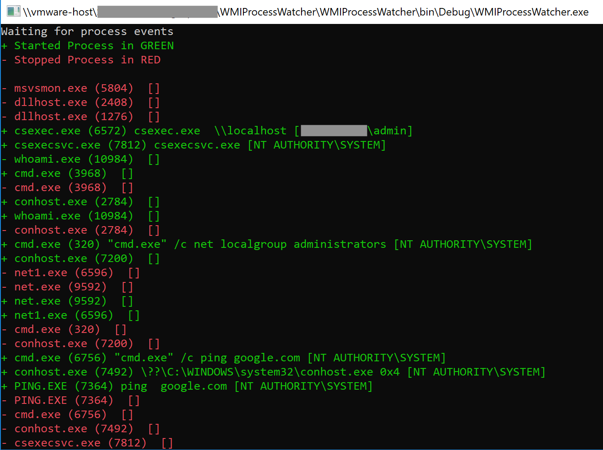

# WMI Process Watcher

Build in Visual Studio (.net 3.5 so it runs on Win 7). 

This is a proof of concept, example project that shows a pattern for how to leverage WMI to monitor process creation and termination events via C#.

NOTE: Short-lived processes will not persist long enough for WMI to capture the command line arguments, unfortunately.

